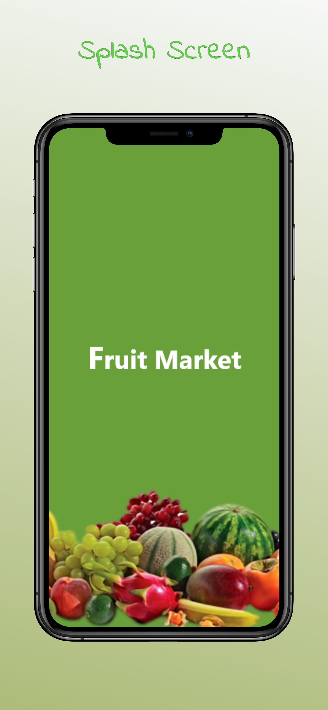
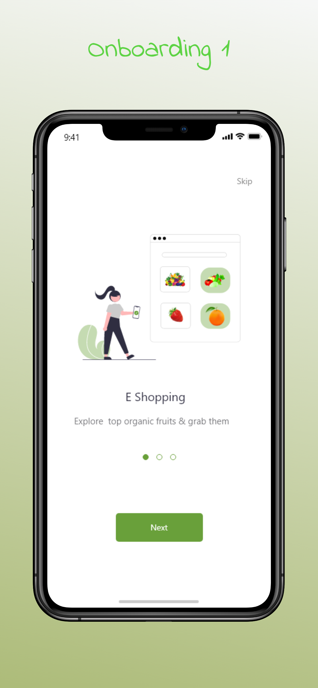
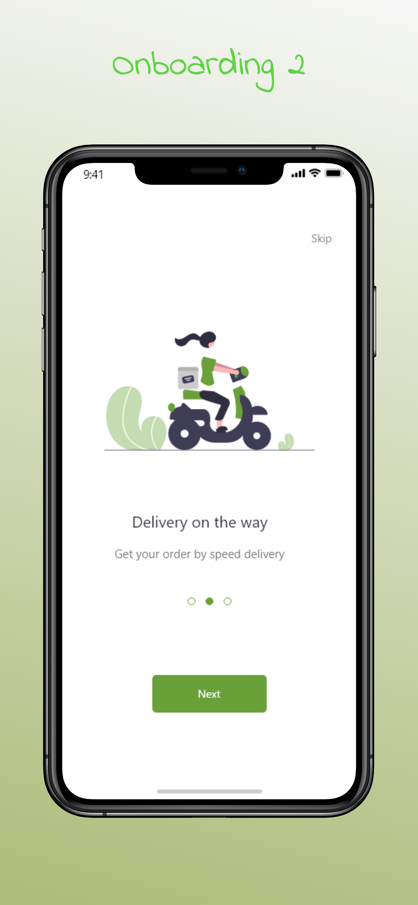
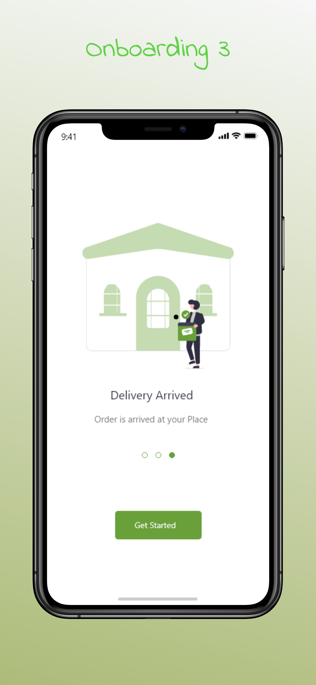
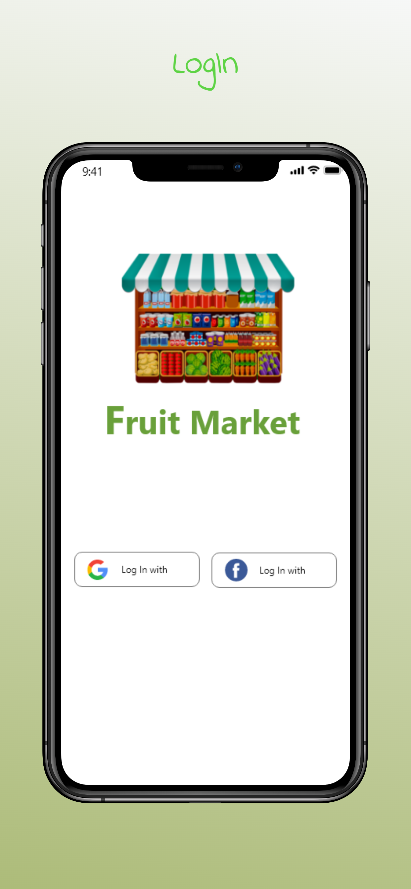
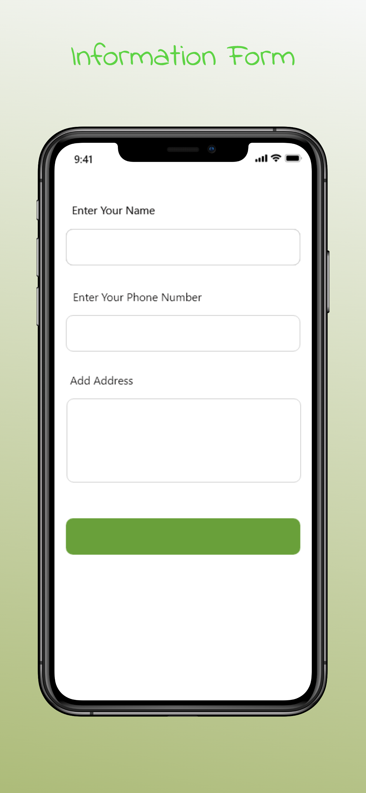

# fruit_market

## integration_testing 👨‍🏫

E-commerce Flutter project. Depending on Bloc as State Management and Firebase as Backend.
Supports the login process via Google account as well as Facebook. It is still under development. 

 

## 📱 Screen Shots

 

## 🔑 License
- This project is licensed under the MIT License - see the [LICENSE](LICENSE.md) file for details

## 🧑 Author

#### Ahmad Alzoabi

You can also follow my GitHub Profile to stay updated about my latest projects:

If you liked the repo then kindly support it by giving it a star ⭐!

Copyright (c) 2023 Ahmad Alzoabi

